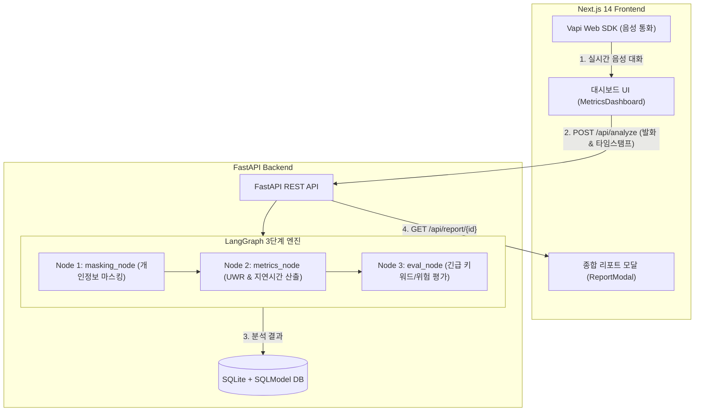

# 🧠 Mind-Anchor (마인드 앵커)
> **고령 VIP 고객 인지 건강 리스크 실시간 관제 및 Vapi AI 대화형 안부 케어 솔루션**

[](https://ambiance-mosaic-unquote.ngrok-free.dev)
[](https://nextjs.org/)
[](https://fastapi.tiangolo.com/)
[](https://www.python.org/)

---

## 🌐 심사위원용 실시간 라이브 데모 (Live Demo)

> 🔗 **체험 링크**: [https://ambiance-mosaic-unquote.ngrok-free.dev](https://ambiance-mosaic-unquote.ngrok-free.dev)
>
> 📌 **접속 가이드**:
> 1. 위 링크를 클릭합니다.
> 2. 접속 시 나타나는 보안 안내 화면에서 **`Visit Site`** 버튼을 클릭합니다. (최초 1회)
> 3. 네이비색 다크 테마의 **인지 건강 관제 대시보드**가 열리며, 실시간 Vapi AI 음성 안부 대화, 4대 신경언어학적 인지 건강 지표 측정 및 종합 소견 리포트 기능을 바로 체험하실 수 있습니다.

---
[](https://www.typescriptlang.org/)
[](https://www.langchain.com/langgraph)
[](https://vapi.ai/)

---

## 📌 목차
1. [프로젝트 소개](#-프로젝트-소개)
2. [핵심 기능](#-핵심-기능)
3. [시스템 아키텍처](#-시스템-아키텍처)
4. [기술 스택](#-기술-스택)
5. [프로젝트 구조](#-프로젝트-구조)
6. [설치 및 실행 방법](#-설치-및-실행-방법)
7. [환경 변수 설정](#-환경-변수-설정)
8. [API 명세서](#-api-명세서)
9. [인지 건강 리스크 평가 산출 로직](#-인지-건강-리스크-평가-산출-로직)

---

## 💡 프로젝트 소개

**Mind-Anchor(마인드 앵커)**는 고령 VIP 고객을 대상으로 AI 음성 안부 전화를 진행하여 실시간 발화 데이터를 수집하고, 신경언어학적 지표(어휘 의미 밀도, 반응 지연 등)를 분석하여 **초기 인지 장애 및 치매 위험군을 조기에 관제하고 긴급 상황에 대응하는 종합 케어 플랫폼**입니다.

* **어르신 특화 1:1 안부 대화**: Vapi AI 음성 기술(Azure SunHi 음성)을 활용한 정중하고 친근한 4턴 안부 대화 진행.
* **실시간 신경언어학 분석**: LangGraph 3단계 노드 기반으로 대화 중 어휘 단순화 및 탐색 지연 시간 측정.
* **학술 논문 기반 4대 지표 측정**: 주제 유지력, 어휘 명확성, 단기 기억 인지력, 반응 속도를 시각화.
* **실시간 VIP 관제 대시보드**: 고객 상태(정상, 주의, 긴급) 실시간 모니터링 및 동적 소견 리포트 생성.

---

## ✨ 핵심 기능

### 1. 🎙️ Vapi AI 실시간 음성 안부 콜
- **자연스러운 1:1 티키타카**: 어르신 발화 속도에 맞춘 넉넉한 응답 대기 및 친근한 톤(Azure SunHi) 제공.
- **실시간 자막 & 스트리밍**: 음성 대화 중 partial STT 자막을 실시간으로 대시보드에 표시.
- **소음/숨소리 방지 및 4턴 자동 종료**: AI 말 끊김(Barge-in) 완벽 예방 및 4번째 대화 턴 후 정중한 안부 마무리.

### 2. 🧩 LangGraph 기반 인지 건강 리스크 파이프라인
- **Node 1 (`masking_node`)**: 실시간 대화 발화 내 개인정보(전화번호, 성함, 금액 등) 자동 정규식 마스킹 (`***`).
- **Node 2 (`metrics_node`)**: 결정론적(Deterministic) 알고리즘으로 **어휘 의미 밀도(Unique Word Ratio, UWR)** 및 **반응 지연 시간(Response Latency)** 계산.
- **Node 3 (`eval_node`)**: 위급 키워드("도와줘", "살려줘", "비밀번호 잊어버렸어" 등) 감지 시 즉시 `EMERGENCY` 플래그 전환.

### 3. 📊 학술 논문 기반 4대 인지 건강 지표 시각화
- **RadarChart (방사형 차트)**: 대화 주제 유지력, 어휘 명확성, 단기 기억 인지력, 반응 속도 4대 항목 동적 측정.
- **Dual Y-Axis 차트 & 게이지 바**: 반응 지연 및 어휘 밀도 변화 추이 시각화.
- **동적 AI 소견 리포트**: 최근 발화 텍스트를 반영한 신경언어학적 종합 판단 소견 자동 작성 및 PDF/모달 출력.

---

## 🏗️ 시스템 아키텍처



---

## 🛠️ 기술 스택

### Frontend
- **Framework**: Next.js 14 (App Router, React 18, TypeScript)
- **Styling**: Tailwind CSS, Framer Motion (애니메이션), Lucide React (아이콘)
- **Charts**: Recharts (RadarChart, Dual Y-Axis, Bar Chart)
- **Voice AI**: `@vapi-ai/web` SDK (Azure SunHi Voice)
- **Notifications**: React Hot Toast

### Backend
- **Framework**: FastAPI (Python 3.12, Uvicorn)
- **ORM & Database**: SQLModel (AsyncSession), SQLite
- **AI Agent Workflow**: LangGraph (StateGraph)
- **Validation**: Pydantic v2

---

## 📁 프로젝트 구조

```text
antigravity/
├── backend/                  # FastAPI 백엔드
│   ├── database.py           # 비동기 SQLite DB 설정 및 시드 데이터 셋업
│   ├── graph.py              # LangGraph 3단계 파이프라인 (Masking -> Metrics -> Eval)
│   ├── main.py               # FastAPI 라우트 및 API 엔드포인트
│   ├── models.py             # SQLModel DB 테이블 & Pydantic 스키마 정의
│   ├── requirements.txt      # 백엔드 의존성 패키지 목록
│   └── test_backend.py       # API 및 워크플로우 단위 테스트
│
├── frontend/                 # Next.js 프론트엔드
│   ├── app/
│   │   ├── globals.css       # 글로벌 CSS 및 스타일
│   │   ├── layout.tsx        # 메인 루트 레이아웃
│   │   └── page.tsx          # 메인 관제 대시보드 페이지
│   ├── components/
│   │   ├── CustomerList.tsx       # VIP 고객 선택 목록 컴포넌트
│   │   ├── MetricsDashboard.tsx   # 실시간 차트 및 4대 인지 지표 컴포넌트
│   │   ├── ReportModal.tsx        # 종합 AI 진단 소견 리포트 모달
│   │   └── VapiControlPanel.tsx   # Vapi AI 음성 통화 패널
│   ├── types/
│   │   └── index.ts          # TypeScript 타입 정의
│   ├── next.config.mjs
│   ├── package.json
│   └── tailwind.config.ts
│
├── .gitignore
└── README.md
```

---

## 🚀 설치 및 실행 방법

### 1. 백엔드 (FastAPI) 실행

#### 요구 사항
- Python 3.10 이상 (Python 3.12 권장)

```bash
# 1. 백엔드 디렉토리 이동
cd backend

# 2. 가상환경 생성 및 활성화
python -m venv venv
source venv/bin/activate   # Windows: venv\Scripts\activate

# 3. 필요 패키지 설치
pip install -r requirements.txt

# 4. 서버 실행
uvicorn main:app --reload --port 8000
```
- 백엔드 접속: `http://localhost:8000 `
- Swagger API 문서: `http://localhost:8000/docs `

---

### 2. 프론트엔드 (Next.js) 실행

#### 요구 사항
- Node.js 18.x 이상 및 npm

```bash
# 1. 프론트엔드 디렉토리 이동
cd frontend

# 2. 패키지 설치
npm install

# 3. 개발 서버 실행
npm run dev
```
- 프론트엔드 접속: `http://localhost:3000 `

---

## 🔑 환경 변수 설정

프론트엔드 `frontend/.env.local` 파일에 Vapi 계정 키를 설정합니다.

```env
NEXT_PUBLIC_VAPI_PUBLIC_KEY=your_vapi_public_key_here
NEXT_PUBLIC_VAPI_ASSISTANT_ID=your_vapi_assistant_id_here
NEXT_PUBLIC_API_BASE_URL=http://localhost:8000
```

---

## 📡 API 명세서

| Method | Endpoint | 설명 |
| :--- | :--- | :--- |
| `GET` | `/` | 백엔드 시스템 상태 확인 |
| `GET` | `/api/customers` | 관제 대상 VIP 고객 목록 (3명) 조회 |
| `POST` | `/api/analyze` | 실시간 발화 데이터 LangGraph 분석 및 진단 저장 |
| `GET` | `/api/report/{customer_id}` | 특정 고객의 4대 지표 및 종합 AI 진단 소견 리포트 조회 |

### `POST /api/analyze` 요청 예시
```json
{
  "customer_id": 1,
  "message": "내가 아침에 약을 먹었는지 기억이 안 나서 조금 걱정되네...",
  "history": [],
  "turn_count": 1,
  "latency_seconds": 3.5
}
```

### `POST /api/analyze` 응답 예시
```json
{
  "customer_id": 1,
  "masked_message": "내가 아침에 약을 먹었는지 기억이 안 나서 조금 걱정되네...",
  "turn_count": 1,
  "avg_response_delay": 3.5,
  "unique_word_ratio": 0.909,
  "risk_score": 39.55,
  "emergency_flag": false,
  "status": "NORMAL"
}
```

---

## 🧮 인지 건강 리스크 평가 산출 로직

LangGraph 파이프라인에서 결정론적(Deterministic) 지표를 다음과 같이 계산합니다:

1. **어휘 의미 밀도 (Unique Word Ratio, UWR)**
   $$\text{UWR} = \frac{\text{서로 다른 고유 단어 수}}{\text{전체 단어 수}}$$
   - 어휘가 단조롭고 반복적일수록 위험도가 올라갑니다 (최대 50점 부여).

2. **반응 지연 리스크 (Response Latency Risk)**
   - 발화 탐색 지연 시간(초당 10점, 최대 50점).
   - 12초 이상 지연 또는 위급 키워드 감지 시 `EMERGENCY` 상태로 직행.

3. **종합 리스크 점수 (0 ~ 100점)**
   $$\text{Total Risk Score} = \min(100, \text{Density Risk} + \text{Latency Risk})$$
   - `0 ~ 39점`: 정상 (NORMAL)
   - `40 ~ 69점`: 주의 (ALERT)
   - `70점 이상 / 긴급 키워드`: 고위험 (EMERGENCY)
